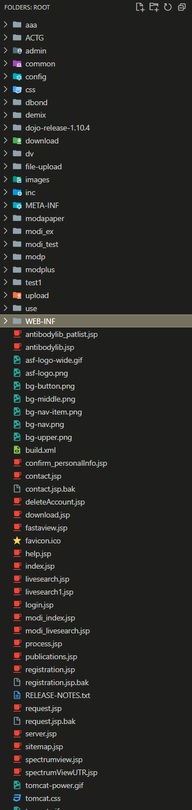
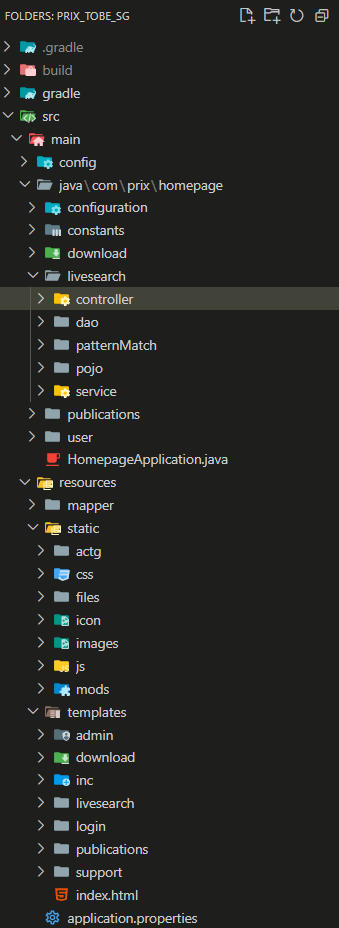

# PRIX_TOBE_SG  
202401 Graduation Project for Second Group  

교내 연구실 홈페이지 웹사이트 프레임워크 전환 프로젝트 입니다.  

---

## 요구 사항  
[졸업플젝 202401 - PRIX Web 언어 전환.pdf](./docs/졸업플젝%20202401%20-%20PRIX%20Web%20언어%20전환.pdf)  

---

## PRIX 구조 분석  
[PRIX 구조.docx](./docs/PRIX%20구조.docx)  

---

## 최종 보고서  
[Final Report](./docs/final_report.pdf)  

---

## 전환 전후 폴더 구조 비교  

  <table>
    <tr>
      <td align="center"><b>전환 전 폴더 구조</b></td>
      <td align="center"><b>전환 이후 폴더 구조</b></td>
    </tr>
    <tr>
      <td></td>
      <td></td>
    </tr>
  </table>

